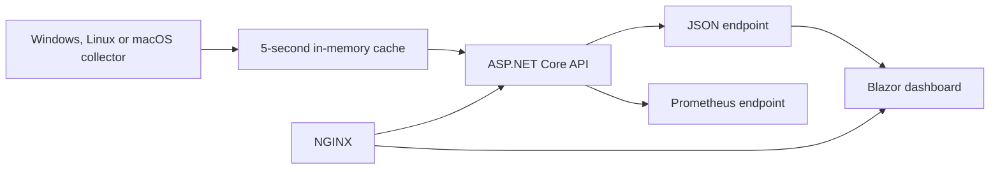

# LocalMetrics


[](https://github.com/louresb/LocalMetrics/actions/workflows/build-and-test.yml?query=branch%3Amain)

LocalMetrics is a cross-platform proof of concept that collects CPU, memory and disk usage from the machine where its API runs. It presents the current values in a Blazor dashboard and exposes a Prometheus-compatible endpoint.

## Architecture



- An operating-system-specific collector reads CPU, memory and disk usage.
- `SystemMetricsService` caches samples to avoid collecting them on every request.
- The API exposes both application-friendly JSON and Prometheus text formats.
- The Blazor Server UI keeps a short in-memory history for its charts.
- Docker Compose can host the UI behind NGINX while the API runs on the monitored host.

## Run locally

Requirements:

- [.NET 10 SDK](https://dotnet.microsoft.com/download/dotnet/10.0), version 10.0.300 or newer
- Docker, only for the containerized UI and NGINX option

Start the API on the machine you want to monitor:

```bash
dotnet run --project src/LocalMetrics.Api
```

For a fully local development run, open another terminal and start the UI:

```bash
dotnet run --project src/LocalMetrics.UI
```

Open `http://localhost:5133`.

To run the UI through Docker and NGINX, the containers need to reach the API on the host. Start the API with an explicit container-accessible binding:

```bash
dotnet run --project src/LocalMetrics.Api -- --urls http://0.0.0.0:5050
```

Then start the UI and reverse proxy:

```bash
docker compose up --build
```

Open `http://localhost`. NGINX is published only on the host loopback interface. On systems that still use Compose v1, run `docker-compose up --build` instead.

## API

| Endpoint | Purpose |
| --- | --- |
| `GET /api/systemmetrics` | Current CPU, memory and disk sample as JSON |
| `GET /metrics` | The same sample in Prometheus text format |
| `GET /swagger` | Interactive API documentation in the Development environment |

The API listens on port `5050` by default. For example:

```bash
curl http://localhost:5050/api/systemmetrics
curl http://localhost:5050/metrics
```

## Tests and CI

Run the complete suite with:

```bash
dotnet test LocalMetrics.sln --configuration Release
```

GitHub Actions builds the solution, runs the unit tests and exercises the native collector on Linux, Windows and macOS.

## Scope and limitations

LocalMetrics intentionally focuses on a single machine and a small set of live metrics. It does not provide persistence, authentication, alerting, remote fleet management or production-grade telemetry storage. Local runs bind to `127.0.0.1`; the Docker command above opts into `0.0.0.0` so containers can reach the host API and should be used only on a trusted development machine with an appropriate firewall.

Contributions and bug reports are welcome through issues and pull requests.
